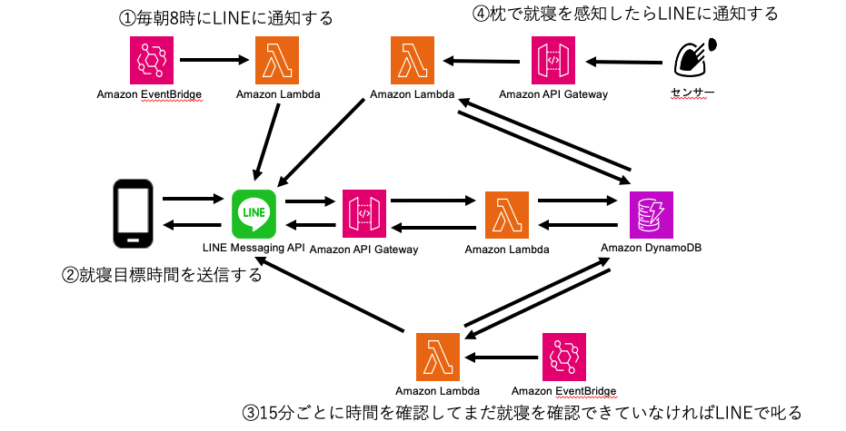

# 「寝かしつけ屋」

夜更かしを注意して約束通りの時間に就寝することを促す LINE bot です．

## Getting Started

### 1. AWS アカウントの作成， SAM CLI のインストール

参考資料：[（公式ドキュメント）AWS SAM CLI のインストール](https://docs.aws.amazon.com/ja_jp/serverless-application-model/latest/developerguide/install-sam-cli.html)

### 2. LINE Developers Account の作成, チャネルの作成

参考資料：[（公式ドキュメント）Messaging API を始めよう](https://developers.line.biz/ja/docs/messaging-api/getting-started/)

### 3. `template.yaml` の環境変数を設定

LINE Developers Console からアクセストークンを発行，ユーザー ID とともに`template.yaml`内の環境変数を書き換える

```yaml
LINE_ACCESS_TOKEN: <アクセストークン>
LINE_USER_ID: <ユーザーID>
```

### 4. デプロイする

```sh
$ aws sso login --profile <YOUR_PROFILE>
$ export AWS_PROFILE=<YOUR_PROFILE>
$ sam build
$ sam deploy
```

### 5. RaspberryPi に光センサーを接続して`/sensor/main.py`を実行する

※ main.py の`TODO`部分は要確認

### 6. リソースを削除する

```sh
$ sam delete
```

## アーキテクチャ図


